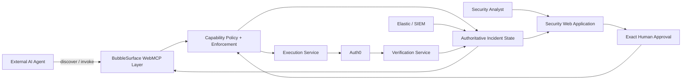

# BubbleSurface

A state-aware, human-governed WebMCP capability layer for cybersecurity applications.

> **The AI doesn't get a permanent security toolbox. It gets only the capabilities valid right now.**

```text
Investigate -> Human Review -> Execute -> Verify -> Recover
```

[Live application](https://bubblesurface-236264514374.asia-south1.run.app) | [Live demo video](https://youtu.be/oMrEiIA67cs)
## Why BubbleSurface

Security agents may need to inspect incidents, review sessions and privilege changes, revoke access, remove privileges, and verify containment. Giving an agent permanent access to all of those operations creates a dangerous static authority boundary: a tool appropriate now may be inappropriate seconds later.

WebMCP gives an agent structured access to capabilities exposed by a page. BubbleSurface governs when those capabilities are available and executable. It derives the current surface from authoritative state, lifecycle, permissions, policy, exact human approval, execution, and verification. Browser discovery is never treated as server authorization.

## Live demo

- Application: <https://bubblesurface-236264514374.asia-south1.run.app>
- Incident workspace: <https://bubblesurface-236264514374.asia-south1.run.app/demo/live>
- Demo video: **Coming shortly**

WebMCP tool discovery currently requires a compatible browser/host or WebMCP inspector/testing support. The normal incident workspace remains usable without the inspector.

## Core idea

The capability surface changes with the response workflow:

| State | Machine-visible change |
| --- | --- |
| Initial investigation | Five read/investigation capabilities are available |
| Evidence validated | `prepare_containment` becomes available |
| Exact human approval | The matching execution capability appears |
| Execution completed | Execution disappears; verification capabilities appear |
| Recovery completed | Sensitive execution and verification capabilities disappear |

The browser reconciles tools as state changes. Every invocation still passes through authoritative server enforcement, so a stale tool reference cannot bypass current policy.

## WebMCP capabilities

These ten tools are **not permanently exposed at the same time**. That dynamic capability lifecycle is BubbleSurface's central design.

| Stage | Tool | Purpose |
| --- | --- | --- |
| Investigate | `inspect_incident` | Reads authoritative incident context |
| Investigate | `get_active_sessions` | Reads sessions associated with the affected identity |
| Investigate | `get_device_context` | Reads related device and security context |
| Investigate | `check_privilege_changes` | Reviews current privileges and privilege-change evidence |
| Investigate | `review_evidence_timeline` | Reads the evidence timeline and completes the investigation boundary when appropriate |
| Prepare | `prepare_containment` | Creates a typed, evidence-backed proposal without executing it |
| Execute | `revoke_approved_sessions` | Revokes only sessions in an exactly approved proposal; not used by the current privilege-removal golden path |
| Execute | `remove_approved_privilege` | Removes only the privilege in the exact approved proposal; the demo removes the dedicated Auth0 user's Finance Administrator role |
| Verify | `verify_containment` | Confirms that the approved containment objective is satisfied |
| Verify | `verify_identity_state` | Reloads authoritative identity-provider state and verifies the intended change |

## Architecture



Invocation follows a deterministic control path:

```text
WebMCP invocation
-> server-side capability enforcement
-> authoritative state reload
-> policy, version, permission, and exact-approval validation
-> provider operation
-> persistence and audit
-> capability refresh
```

Verification performs a fresh provider read, persists the result, advances lifecycle only when requirements are satisfied, and refreshes the capability surface.

## Security model

> **Authority by structure, not by prompt.**

- Discovering a browser tool does not grant execution authority.
- Sensitive calls are revalidated server-side against current state.
- Stale lifecycle versions and stale or superseded proposals are rejected.
- Rejected proposals cannot execute; the exact proposal version must be approved.
- Provider operations are scoped to the authorized targets.
- Execution and verification use idempotency and replay protection.
- Verification reads authoritative provider state after execution.
- Cached references remain blocked after a capability is no longer applicable.

These controls reduce accidental and stale authority; they are not a claim of formal verification or complete production security.

## Demo scenario

The deterministic demo follows incident `INC-1001` for Asha Mehta (`IDN-ASHA`), reviewed by Kavya (`analyst-kavya`). Evidence includes an unfamiliar Frankfurt login, MFA anomalies, a suspicious refresh-capable session (`SES-ASHA-SUSPICIOUS`), an out-of-window Finance Administrator grant, and access to a finance resource.

The sensitive target is `PRV-ASHA-FINADMIN`, mapped to the Auth0 role **Finance Administrator**:

```text
review_evidence_timeline
-> prepare_containment
-> human approves the exact proposal
-> remove_approved_privilege
-> verify_identity_state
-> verify_containment
-> RECOVERED
```

Execution removes the role from the dedicated Auth0 demo user. Verification independently reads Auth0 again and confirms that it is absent.

## Integrations and human experience

BubbleSurface combines provider state through replaceable adapters. Elastic supplies the security-event timeline. Auth0 supplies current privilege state, the real mutation target, and authoritative post-action verification. SQLite holds the reference incident lifecycle, proposals, approvals, executions, verifications, audit/activity, and fixture context.

The UI roles stay separate:

- Host page: persistent incident state and outcomes
- `BubbleSurfacePanel`: the demo's only human review/decision surface
- Optional notifications: transient awareness; hosts may disable them
- WebMCP inspector: developer/demo proof, not production human UI

The same `/demo/live` page moves through Investigate, Review, Execute, Verify, and Recovered from authoritative backend state. It uses no Next buttons, route transitions, or invented frontend workflow state.

## WebMCP implementation

The browser adapter registers current capabilities through:

```ts
document.modelContext.registerTool(tool, { signal });
```

Dedicated abort signals remove tools. `BubbleSurfaceWeb` reconciles added, retained, and removed registrations during initialization, polling, explicit refresh, successful approval, invocation completion, subject changes, and disposal. Server enforcement remains authoritative if an agent retains an older callback.

## Technology

Next.js 15, React 19, TypeScript, Zod, SQLite with `better-sqlite3`, Auth0 Management API, Elastic, OpenAI structured reasoning when configured, WebMCP, Docker, and Google Cloud Run.

## Quick start

From the repository root:

```sh
cd hi
npm install
cp .env.example .env.local
npm run dev
```

Configuration names are documented in [.env.example](.env.example). Keep all provider credentials server-side. See [installation](docs/install.md), [usage](docs/usage.md), and the [demo runbook](docs/demo.md).

The reference app reads `DATABASE_PATH`, `SECURITY_EVENT_SOURCE`, `ELASTIC_ENDPOINT`, `ELASTIC_API_KEY`, `IDENTITY_PROVIDER`, `AUTH0_DOMAIN`, `AUTH0_CLIENT_ID`, `AUTH0_CLIENT_SECRET`, `AUTH0_MANAGEMENT_AUDIENCE`, `AUTH0_ASHA_USER_ID`, `OPENAI_API_KEY`, and `OPENAI_MODEL`. Okta-shaped values also appear in `.env.example`, but no Okta adapter is currently implemented.

Demo preparation:

```sh
npm run prepare:demo:auth0
npm run prepare:demo
npm run preflight:demo
```

`prepare:demo:auth0` mutates only the configured dedicated demo account after strict ID and email validation. Never point it at an arbitrary production tenant.

## Testing

The repository currently has **148 passing tests** covering lifecycle transitions, capability applicability and reconciliation, exact approval/versioning, stale invocation rejection, execution authorization and replay protection, Auth0 safety boundaries, verification, the human panel, notification deduplication, and living-workspace state mapping.

```sh
npm test
npm run typecheck
npm run build
```

## Docker and Cloud Run

The application image is defined at `hi/Dockerfile`. The public hackathon service is `bubblesurface` in `asia-south1` and listens on Cloud Run's `PORT` (8080).

SQLite state is container-local and ephemeral. Keep the hackathon service at a maximum of one instance for a coherent demo session. This is intentionally not presented as production persistence.

## Limitations

- WebMCP browser support is still emerging and feature-detected.
- The public demo uses one deterministic incident scenario.
- SQLite state is ephemeral and instance-local on Cloud Run.
- Elastic and Auth0 are reference provider adapters, not the product itself.
- Execution is intentionally restricted to a dedicated Auth0 test identity.
- Production use still needs durable storage, tenant authentication/authorization, concurrency hardening, and deployment-specific controls.

## Documentation

- [Install and deployment](docs/install.md)
- [Developer and operator usage](docs/usage.md)
- [Demo rehearsal](docs/demo.md)
- [Integration architecture](docs/integration-architecture.md)
- [WebMCP notes](docs/webmcp-notes.md)
- [Human surface](docs/human-surface.md)
- [Devpost draft](docs/devpost.md)

## License

[MIT](LICENSE) © 2026 Khushboo Rani
