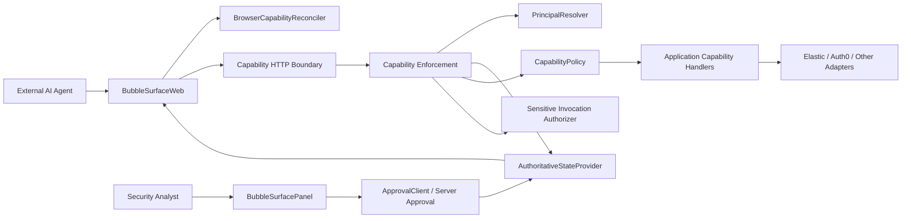

# BubbleSurface integration architecture

## Purpose and scope

BubbleSurface is a reusable WebMCP capability/control layer for cybersecurity applications. It does not replace an application's incident model, identity system, event store, provider integrations, or analyst UI. It turns those application-owned facts and functions into state-aware browser capabilities, keeps the browser registry synchronized, and re-enforces authority on the server before consequential work.

The current security-operations demo is the first consumer. Its ten existing tool names, lifecycle, reasoning, exact-version approval, execution, verification, audit, and idempotency behavior remain intact. Auth0, Elastic, the seeded identities, and `INC-1001` are demo composition details, not reusable-core dependencies.



## A. What another cybersecurity application owns

An integrating application owns:

- its subject identifiers and cybersecurity subject types (incident, finding, alert, identity investigation, and so on);
- the authoritative subject state and monotonically changing version;
- authenticated actor identity and permissions;
- proposal/action persistence and exact approval records;
- execution and verification persistence/idempotency;
- the functions it wants to expose as capabilities;
- evidence, events, identities, sessions, privileges, devices, and other product data;
- vendor adapters and credentials;
- its human approval UI, if it already has one;
- its HTTP/session/authentication boundary.

Authentication remains application-owned. BubbleSurface consumes a `ResolvedPrincipal` produced server-side by the application's `PrincipalResolver`; a browser-supplied actor ID is never trusted authority.

The application supplies these facts through descriptors and small interfaces. It does not call `document.modelContext.registerTool` or manage registration abort signals.

## B. What BubbleSurface owns

BubbleSurface owns:

- WebMCP feature detection;
- conversion of allowed capability snapshots into browser registrations;
- one registration signal/controller per tool and signal-based removal;
- added/retained/removed reconciliation;
- refresh after invocation, optional interval refresh, explicit refresh, and full disposal;
- capability descriptors and a duplicate-safe registry;
- a vendor-neutral authoritative-state and policy boundary;
- a generic server enforcement facade;
- a framework-neutral HTTP-shaped adapter over principal resolution, discovery, and invocation;
- authoritative-version enforcement and invocation-schema/output validation;
- a sensitive-invocation authorizer boundary;
- approval contracts that back the current optional `BubbleSurfacePanel` or an application's existing UI.

The concrete demo enforcement remains stricter than the generic minimum: it reloads SQLite context and checks lifecycle, permissions, action type, latest proposal version, exact approval, execution state, applicability, and replay/idempotency before performing work.

## C. Browser integration flow

`BubbleSurfaceWeb` is the application-facing controller:

1. `BubbleSurfaceWeb.init(options)` detects WebMCP support and fetches the first authoritative capability snapshot through a transport.
2. `BrowserCapabilityReconciler` compares desired names with currently registered names.
3. Removed tools are unregistered by aborting their dedicated registration signal.
4. Added tools are registered through the browser adapter; retained tools are left untouched.
5. Each registered handler routes invocation through the transport and overlays the snapshot subject ID and authoritative version.
6. After every invocation, the controller refreshes again so approval, execution, and verification changes appear promptly.
7. An optional interval catches state changes made elsewhere, such as approval in another UI.
8. `refresh()` allows explicit application-triggered reconciliation.
9. `setSubject(subject)` supersedes an active refresh, clears old authoritative context, and reconciles away tools that do not apply to the new subject.
10. `dispose()` stops the interval and unregisters every tool. React cleanup calls it on unmount/navigation.

`BubbleSurfaceWebError` classifies unavailable WebMCP, refresh failures, registration failures, and invocation failures. An application can observe state and errors without owning registration mechanics.

The demo React bootstrap now uses this controller and a reusable HTTP transport. It no longer manually implements one-time tool registration. Its selected demo subject remains `INC-1001` until a real subject-selection UI is built.

## D. Capability registration flow

Applications create `WebMcpToolDefinition` descriptors and add them to `CapabilityRegistry`. A descriptor contains:

- stable `name`/capability ID;
- human-readable description;
- `READ`, `PREPARE`, `EXECUTE`, or `VERIFY` classification;
- Zod input and output schemas;
- optional applicable subject types/categories;
- optional permission, authoritative-version, and exact-approval requirements;
- optional verification requirements/kinds;
- the application handler.

The registry accepts arbitrary stable string names; the reusable core does not require the demo tool enum. Duplicate names are rejected. The demo's ten definitions populate this same registry with identity-compromise applicability and their existing handlers.

The demo route still validates its known ten names for backward compatibility. A different application can expose its registry through its own route/controller or use `CapabilityEnforcementService` directly.

## E. State and policy connection

`AuthoritativeStateProvider<TState>` loads current state for a `CapabilitySubject` and actor. The minimum reusable state contains:

- subject type/ID/category;
- authoritative version and state;
- actor ID and permissions.

The actor is a `ResolvedPrincipal` with ID, principal type, permissions, optional roles, and optional future tenant/workspace context. `PrincipalResolver<RequestContext>` runs on the integrating application's server and derives it from trusted request/session context. Client actor IDs are not part of reusable invocation or approval authority.

Applications may extend it with proposal authorities, approval/execution/verification state, risk, evidence sufficiency, or product-specific cybersecurity facts.

`CapabilityPolicy<TState>` evaluates one descriptor against current state and returns an allowed decision or a reason code/message. This preserves useful cybersecurity semantics: a policy can require incident category, evidence, analyst permissions, exact approved actions, containment state, risk thresholds, or verification readiness without putting one vendor or demo into the core.

The demo continues to derive `CapabilityContext` from its lifecycle, incident category, evidence, proposal versions, decisions, executions, and verifications, then applies its existing policy unchanged.

## F. Server enforcement

Browser declarations are discovery only. They are never proof of authority.

`CapabilityEnforcementService` provides a generic application-facing boundary:

- `getCapabilities(subject, principal)` loads authoritative state and evaluates every registered descriptor;
- `invoke(...)` resolves the descriptor, validates input, reloads authoritative state, checks the exact expected version, evaluates current policy, requires a sensitive authorizer for EXECUTE/VERIFY, calls the handler, and validates output.

`CapabilityHttpAdapter<RequestContext, State>` is the framework-neutral connector over that service. A framework route passes its request context plus subject or invocation data. The adapter resolves the trusted principal, discovers or invokes through enforcement, serializes a browser-compatible `{context, tools}` snapshot, and returns structured `{status, body}` results for validation, denial, unknown capability, stale version, and internal failures. Actor-like values in browser arguments are ignored for authorization.

`SensitiveInvocationAuthorizer` is where an application enforces current proposal/action matching, exact latest approval, execution state, replay/idempotency, and any additional consequential-action rule.

The current demo's `ToolInvocationService` remains its concrete enforcement specialization. It additionally:

- derives state again on every call;
- rejects stale lifecycle versions;
- requires the latest proposal version for execution;
- requires the exact version's approval;
- matches the execution tool to the approved action type;
- blocks a successful prior execution;
- re-runs the capability policy;
- audits calls and blocked calls;
- delegates to execution/verification services that repeat authority, target, permission, lifecycle, and idempotency checks.

This defense remains effective when a browser or agent holds a previously discovered tool after the server state changes.

## G. Human approval integration

`ApprovalClient` and `ServerApprovalIntegration` are UI-neutral contracts for:

- listing proposals for a subject;
- reading an action and all proposal versions/decisions;
- approving an exact action/version at an expected lifecycle version;
- rejecting an exact action/version;
- modifying and superseding a proposal.

The server form receives a trusted `ResolvedPrincipal` separately from mutation input. The application adapts its proposal service and uses that principal as the actor. Existing demo routes use clearly labeled unauthenticated demo resolvers and retain `ProposalReviewService` exact-version semantics; submitted demo actor IDs are ignored.

`RefreshingApprovalClient` decorates any `ApprovalClient`. Successful approve, reject, and modify calls immediately await `BubbleSurfaceWeb.refresh()`; failed mutations do not refresh. Interval refresh remains fallback reconciliation protection. Execution-triggered browser invocations also refresh automatically.

## H. Provider adapter integration

Vendors stay outside the reusable core. Existing generic ports are:

- `SecurityEventSource` for event search and evidence timelines;
- `IdentityProvider` for identity/current sessions/current privileges;
- `IdentityActionExecutor` for bounded action execution;
- `IdentityVerificationSource` for fresh post-action observation.

An application can implement these ports for its own SIEM, IAM, EDR, cloud, or internal services. BubbleSurface capability descriptors depend on the ports supplied by composition, not on vendor names.

The current SQLite implementations are demo/local references. Elastic implements the event-source port, and Auth0 implements selected identity/privilege execution/verification behavior. Neither is imported by the reusable registry, browser controller, reconciler, integration contracts, or generic enforcement service.

## I. Example integration pseudocode

```ts
const registry = new CapabilityRegistry()
  .register({
    name: "search_security_alerts",
    description: "Search alerts related to the current investigation",
    classification: "READ",
    applicability: { subjectTypes: ["ALERT"] },
    policyRequirements: {
      permissions: ["INVESTIGATE"],
      authoritativeVersion: true,
    },
    inputSchema: z.object({ query: z.string() }),
    outputSchema: z.object({ alerts: z.array(alertSchema) }),
    execute: ({ query }, context) => alertService.search(context.subjectId, query),
  })
  .register({
    name: "isolate_approved_endpoint",
    description: "Isolate only the endpoint in the exact approved action",
    classification: "EXECUTE",
    applicability: { subjectTypes: ["INCIDENT"] },
    policyRequirements: {
      permissions: ["EXECUTE"],
      authoritativeVersion: true,
      exactApproval: true,
    },
    verification: { required: true, kinds: ["VERIFY_ENDPOINT_ISOLATION"] },
    inputSchema: approvedActionInput,
    outputSchema: executionResult,
    execute: (input, context) => endpointExecutor.isolate(input, context),
  });

const enforcement = new CapabilityEnforcementService(
  registry,
  applicationAuthoritativeStateProvider,
  applicationCapabilityPolicy,
  applicationExactApprovalAndReplayAuthorizer,
);

const httpAdapter = new CapabilityHttpAdapter(enforcement, applicationServerPrincipalResolver);

// In the browser:
const web = await BubbleSurfaceWeb.init({
  subject: { type: "INCIDENT", id: currentIncidentId },
  transport: applicationCapabilityTransport,
  refreshIntervalMs: 2000,
  onChange: renderCapabilityStatus,
  onError: reportCapabilityError,
});

// After approval in the application's existing UI:
await refreshingApprovalClient.approve({ actionId, proposalVersion, expectedLifecycleVersion });

// Change page context without leaking the old subject's tools:
await web.setSubject({ type: "INCIDENT", id: nextIncidentId });

// On navigation/unmount:
await web.dispose();
```

The sensitive authorizer must independently reload the proposal/action and verify exact approval and replay state. It must not trust the browser descriptor or the previously returned capability snapshot.

## J. How the existing demo consumes this architecture

- `createWebMcpToolDefinitions` supplies ten application descriptors with existing names/handlers and cybersecurity metadata.
- `src/server/container.ts` registers them in `CapabilityRegistry`, then exposes the record to existing routes/services to preserve compatibility.
- `SqliteCapabilityContextRepository` remains the demo authoritative-state implementation.
- `evaluateCapabilities` remains the demo policy implementation.
- `ToolInvocationService`, `ActionExecutionService`, and `ActionVerificationService` remain the demo's strict enforcement/authorization/idempotency specialization.
- Demo routes resolve explicit unauthenticated demo principals server-side and ignore submitted actor identity for authorization.
- SQLite, Elastic, and Auth0 adapters are selected only in demo composition.
- the `/demo/live` bootstrap uses `BubbleSurfaceWeb` and `HttpCapabilitySnapshotTransport` instead of directly registering tools.
- Both `CapabilityRefreshService` and `BubbleSurfaceWeb` now use the same `BrowserCapabilityReconciler` path.

## Target integration journey

1. Install or include BubbleSurface modules.
2. Initialize `BubbleSurfaceWeb` in the browser integration page.
3. Register the application's existing security functions as capability descriptors.
4. Connect authoritative state and capability policy providers.
5. Connect a server-side principal resolver and configure exact approval/sensitive-action requirements.
6. Optionally connect the application's human approval UI through `ApprovalClient`.
7. Open the page with a WebMCP-capable agent.
8. BubbleSurface exposes only currently valid tools and revalidates every invocation on the server.

## Deliberate remaining demo coupling

The reusable extraction does not replace the demo lifecycle or data model, remove closed-name validation from demo routes, add production authentication, redesign persistence, or implement jobs/outbox. The completed demo page selects `INC-1001`, while reusable `setSubject` supports safe context changes for other host applications.

## Final connector path

```text
Client live page -> BubbleSurfaceWeb -> WebMCP

Client server -> CapabilityHttpAdapter -> PrincipalResolver
              -> authoritative state/policy -> registered capability handlers

Human UI -> approval integration -> server mutation
         -> RefreshingApprovalClient -> BubbleSurfaceWeb.refresh()
         -> WebMCP surface changes immediately
```
